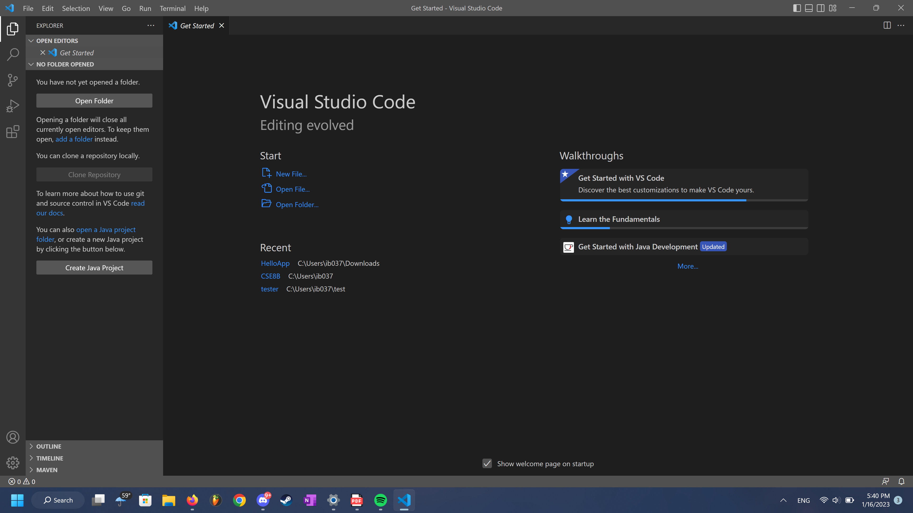

# Lab Report 1
In this lab report, I will be explaining the steps as to how to log into a course-specific account on `ieng6` through Visual Studios code and remotely connecting along with trying some commands within the remote conenction.

Through this report, we will be: 
* Installing VScode
* Remotely connecting 
* Trying some commands

We will be continuing assuming that you have successfully found your specific CSE15L account here:

[https://sdacs.ucsd.edu/~icc/index.php](https://sdacs.ucsd.edu/~icc/index.php)

## Installation of Visual Studio Code
First we will go about installing Visual Studio code. Of course, the computers in the labs have visual studio installed on the computers. We, however, are interested in installing Visual Studio on our own computers. 

To download Visual Studio code, go to the official website
[https://code.visualstudio.com](https://code.visualstudio.com/)
, download and install. 

Once you download and open up visual studio code, you should get a screen similar to the one above. The color may vary depending on the default settings or depending if you already have it installed and customized the colors. 

For now we have completed the first step of installing visual studio code. 

## Remotely Connecting
After the installation of Visual Studio code, we will be using it to remotely connect to a server using our course-specific account that we found earlier. 

For me, since I am on windows, I downloaded and installed:

[Git for Windows](https://gitforwindows.org/)

I then went in Visual Studio code and set the terminal to use `bash` by default.

## Trying Some Commands
