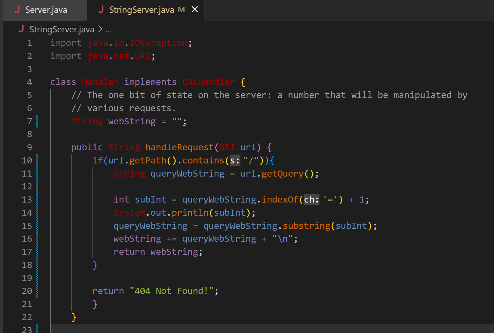
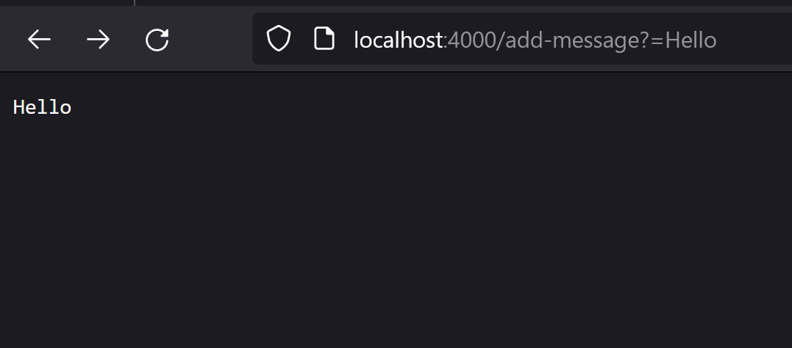
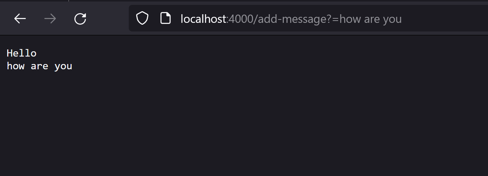

# Lab Report 2
In this Lab Report, I will be explaining a web server called `StringServer` and it's behaviors, along with explaining one of the bugs from the third lab.

## Part 1

We write a web server that is called `StringServer`. We want it to be able to keep track of a single string that gets added to by incoming requests that look like this:
`/add-message?s=<string>`

In the code, we can see that I based it off of the code from the lab. I did change a few things. First of all, we keep the if statement that checks if the url contains `/`, in order to obtain the string from the url that we are looking for. We then use `.getQuery()` in order to obtain the query. We store the location of `=`, which will let us know the location of our string so we can use `.substring()` in order to pull the string and store it in our variable `webString`. 

We add the string that we are currently dealing with to `webstring` and adding `\n` to indicate a new line. We then return the `webstring`, which will appear on our server. 

As long as what we want included in our string is on the right side of `=`, it will be treated as a string and added on.

## Part 3
Something that I learned from this lab was running a server on a remote computer. This is the first time I have played around with this. I did struggle at first due to being confused on why the port had to be different but I though it was interesting how I was able to access a server from another computer, granted both were on the same port. 
